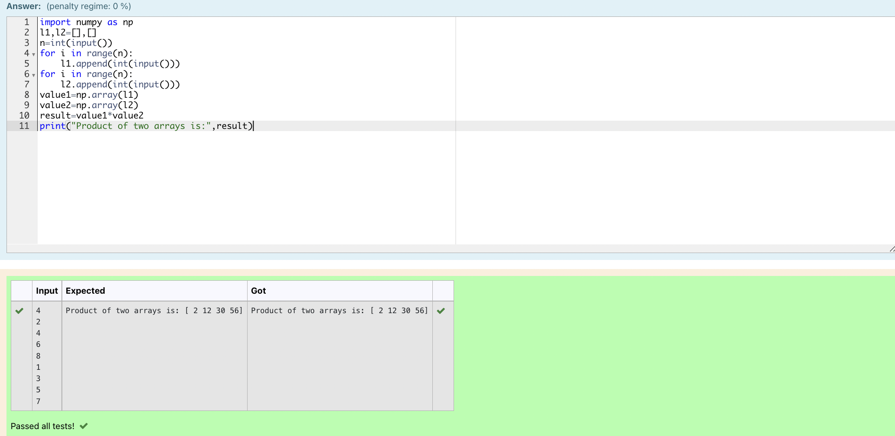

# Multiplying-two-matrix

## AIM:
To Multiply two array
## ALGORITHM:

### Step 1:
 Import numpy as np 
### Step 2:
 Create an empty list 
### Step 3:
 Use append of the two lists 
### Step 4:
Assign the arrays 
### Step 5:
 In result multiply the assigned variables 
## PROGRAM: 
```
#Name: Kamannakatta Devi Jhansi
#Reference Number:21005096
import numpy as np
l1,l2=[],[]
n=int(input())
for i in range(n):
    l1.append(int(input()))
for i in range(n):
    l2.append(int(input()))
value1=np.array(l1)
value2=np.array(l2)
result=value1*value2
print("Product of two arrays is:",result)
```
## OUTPUT:

## RESULT:
Multiplying two arrays is successfully completed
